# Obesity Classification Notebook — Full Detailed Documentation

> **Notebook:** [Obesity_Last.ipynb](file:///d:/Notebooks/Obesity_Last.ipynb)
> **Purpose:** End-to-end obesity risk classification ML project
> **Structure:** 103 cells (~11,000 lines) — richly styled HTML/Markdown narrative + Python code

---

## Table of Contents

1. [Overview](#1-overview)
2. [Dataset & Features](#2-dataset--features)
3. [Notebook Workflow (15 stages)](#3-notebook-workflow-15-stages)
4. [Stage-by-Stage Details](#4-stage-by-stage-details)
5. [Model Comparison Results](#5-model-comparison-results)
6. [Hyperparameter Tuning Details](#6-hyperparameter-tuning-details)
7. [Validation Evaluation & Model Selection](#7-validation-evaluation--model-selection)
8. [BMI Label-Proxy Sensitivity Check](#8-bmi-label-proxy-sensitivity-check)
9. [Feature Importance Analysis](#9-feature-importance-analysis)
10. [Top-10 Feature Subset Experiment](#10-top-10-feature-subset-experiment)
11. [Final Model & Deployment](#11-final-model--deployment)
12. [Design Highlights & Best Practices](#12-design-highlights--best-practices)
13. [Potential Considerations](#13-potential-considerations)

---

## 1. Overview

The notebook is a **comprehensive, end-to-end machine learning project** that classifies individuals into **four obesity-related weight-status groups** using demographic, behavioral, and body-measurement features. It is structured as 103 cells (a mix of richly styled HTML/Markdown narrative cells and Python code cells) spanning approximately 11,000 lines.

> [!IMPORTANT]
> The notebook is explicitly framed as a **benchmarking / ML exercise**, not a standalone clinical prediction model, because BMI (derived from Height and Weight) is a near-perfect proxy for the target classes. The author acknowledges this transparently in a dedicated sensitivity analysis section.

### Key Technologies & Libraries

- **Python 3** with Jupyter Notebook
- **pandas** – data loading and manipulation
- **NumPy** – numerical operations
- **matplotlib / seaborn** – visualization
- **scikit-learn** – preprocessing, model training, evaluation, tuning
- **XGBoost** – gradient boosting classifier
- **scipy** – statistical tests (ANOVA, Chi-squared, Spearman)

### Custom Visualization Palette

The notebook uses a consistent three-color scheme throughout all plots:

| Name | Purpose |
|---|---|
| **Shiny Blue** (`#0077B6`) | Primary color for section headers, training curves |
| **Shiny Green** (`#00B894`) | Section tags, positive indicators |
| **Hot Red** (`#E63946`) | Warnings, validation curves, alerts |

---

## 2. Dataset & Features

### Source & Shape

| Aspect | Detail |
|---|---|
| **Source file** | `train.csv` |
| **Shape** | 20,758 rows x 18 columns (before preprocessing) |
| **Duplicates** | 0 |
| **Missing values** | 0 across all columns |

### Complete Feature Dictionary

| Column | Meaning | Modeling Role |
|---|---|---|
| `id` | Unique row identifier | **Dropped** (no predictive value) |
| `Gender` | Person's gender | Categorical predictor (Binary) |
| `Age` | Age in years | Numerical predictor |
| `Height` | Height in meters | Used to compute BMI, then **dropped** |
| `Weight` | Weight in kilograms | Used to compute BMI, then **dropped** |
| `BMI` | Weight / Height squared (**engineered**) | Strongest numerical predictor |
| `family_history_with_overweight` | Family history of overweight | Binary categorical |
| `FAVC` | Frequent high-calorie food consumption | Binary categorical |
| `FCVC` | Vegetable consumption frequency | Numerical lifestyle |
| `NCP` | Number of main meals | Numerical lifestyle |
| `CAEC` | Snacking between meals | **Ordinal** categorical (no, Sometimes, Frequently, Always) |
| `SMOKE` | Smoker? | Binary categorical |
| `CH2O` | Daily water consumption | Numerical lifestyle |
| `SCC` | Calorie-consumption monitoring | Binary categorical |
| `FAF` | Physical-activity frequency | Numerical lifestyle |
| `TUE` | Time on tech devices | Numerical lifestyle |
| `CALC` | Alcohol consumption | **Ordinal** categorical (no, Sometimes, Frequently, Always) |
| `MTRANS` | Main transportation mode | **Nominal** categorical |
| `NObeyesdad` | **Target** — original 7 labels grouped to 4 | Target variable |

### BMI Feature Engineering

BMI is calculated as Weight divided by Height squared. Height and Weight are then **excluded** from the final feature set after BMI computation. A commented-out BSA (Body Surface Area) line is visible in the code but not used.

### Target Grouping (7 to 4 classes)

| Original Label | Grouped Class |
|---|---|
| `Insufficient_Weight` | **Underweight** |
| `Normal_Weight` | **Normal** |
| `Overweight_Level_I` | **Overweight** |
| `Overweight_Level_II` | **Overweight** |
| `Obesity_Type_I` | **Obesity** |
| `Obesity_Type_II` | **Obesity** |
| `Obesity_Type_III` | **Obesity** |

### Post-Grouping Class Distribution (Full Dataset)

| Class | Count | Percentage |
|---|---|---|
| Obesity | 10,204 | 49.2% |
| Overweight | 4,949 | 23.8% |
| Normal | 3,082 | 14.8% |
| Underweight | 2,523 | 12.2% |

> [!NOTE]
> The target is **imbalanced** (Obesity is approximately 49%). This is why **Macro F1** is the primary evaluation metric throughout the project.

### Final Feature Lists

- **Numerical (7):** Age, FCVC, NCP, CH2O, FAF, TUE, BMI
- **Categorical (8):** Gender, family_history_with_overweight, FAVC, CAEC, SMOKE, SCC, CALC, MTRANS
- **Total features:** 15

---

## 3. Notebook Workflow (15 stages)

```mermaid
flowchart LR
    A["01 Data Loading"] --> B["02 BMI Engineering"]
    B --> C["03 Target Grouping"]
    C --> D["04 Data Quality"]
    D --> E["05 Descriptive Stats"]
    E --> F["06 EDA & Visualization"]
    F --> G["07 Association Analysis"]
    G --> H["08 Preprocessing"]
    H --> I["09 Model Comparison"]
    I --> J["10 Hyperparameter Tuning"]
    J --> K["11 Validation Evaluation"]
    K --> L["12 BMI Proxy Check"]
    L --> M["13 Feature Importance"]
    M --> N["14 Top-10 Feature Experiment"]
    N --> O["15 Final Model & Deployment"]
```

---

## 4. Stage-by-Stage Details

### Stage 1 — Data Loading

- Source: `train.csv`
- Library: `pandas.read_csv()`
- Result: DataFrame with 20,758 rows and 18 columns

### Stage 2 — BMI Feature Engineering

- Formula: BMI = Weight / Height squared
- Height and Weight columns are subsequently removed from the feature set
- Rationale: BMI serves as a strong proxy that combines both measurements

### Stage 3 — Target Grouping (7 to 4 classes)

- The 7 original NObeyesdad labels are mapped to 4 broader, clinically meaningful categories
- **Idempotent design:** The code checks if the target is already grouped before re-mapping, preventing NaN on notebook re-runs

### Stage 4 — Data Quality Checks

- **Missing values:** Confirmed 0 across all columns
- **Duplicates:** Confirmed 0
- **Data types:** Verified correct types for all columns

### Stage 5 — Descriptive Statistics

- Statistical summaries for all features
- Distribution characteristics documented

### Stage 6 — EDA & Visualization

Comprehensive exploratory data analysis, explicitly labeled as **descriptive-only** (not used for feature selection or model optimization):

- Target class bar chart
- Histogram + boxplot grids for each numerical feature
- Count-plot grids for each categorical feature
- Boxplots of numerical features by target class
- Stacked bar charts of categorical features by target class
- Profile heatmap (mean numerical features by target class)

#### Outlier Detection

Uses the **IQR method** for all numerical features:

| Feature | Outlier Count | Outlier % | Lower Bound | Upper Bound |
|---|---|---|---|---|
| Age | 1,074 | 5.17 | 11.00 | 35.00 |
| FCVC | 0 | 0.0 | 0.50 | 4.50 |
| NCP | Skipped | IQR = 0 | 3.00 | 3.00 |
| CH2O | 0 | 0.0 | 0.66 | 3.69 |
| FAF | 0 | 0.0 | -2.36 | 3.96 |
| TUE | 0 | 0.0 | -1.50 | 2.50 |
| BMI | 0 | 0.0 | 4.70 | 56.40 |

> [!NOTE]
> NCP is skipped because its IQR equals 0. Age has 1,074 outliers (5.17%) but these are not removed — they represent valid age ranges in the dataset.

### Stage 7 — Association Analysis

Statistical tests measuring feature-target relationships:

| Method | What it tests | Applied to |
|---|---|---|
| ANOVA (F-test) | Numerical vs. categorical target | All 7 numerical features |
| Chi-squared + Cramer's V | Categorical vs. categorical target | All 8 categorical features |
| Spearman correlation | Ordinal vs. target (encoded) | Ordinal features (CAEC, CALC) |
| Correlation ratio (eta) | Numerical vs. categorical target | All 7 numerical features |
| Numerical correlation heatmap | Numerical-to-numerical | Among the 7 numerical features |

#### Multicollinearity Check

- **Numerical by Numerical:** Pearson correlation heatmap
- **Numerical by Categorical:** Custom correlation ratio (eta) function
- **Categorical by Categorical:** Cramer's V
- **Key finding:** "The strongest numerical relationship is between Age and BMI, but it is moderate rather than dangerously high." No severe redundancy detected after Height/Weight removal.

### Stage 8 — Preprocessing Pipeline

A `sklearn.compose.ColumnTransformer` with three transformers:

| Transformer | Features | Details |
|---|---|---|
| **RobustScaler** | Age, FCVC, NCP, CH2O, FAF, TUE, BMI | Robust to outliers — uses median/IQR |
| **OrdinalEncoder** | CAEC, CALC | Explicit category ordering: no, Sometimes, Frequently, Always. CALC "Always" kept even though absent from training data (present in test data). Uses `unknown_value=-1`. |
| **OneHotEncoder** | Gender, family_history, FAVC, SMOKE, SCC, MTRANS | `handle_unknown="ignore"` |

#### Target Encoding

LabelEncoder with explicit class order: Underweight = 0, Normal = 1, Overweight = 2, Obesity = 3.

#### Data Splitting

**Stratified three-way split:**

| Split | Size | Rows |
|---|---|---|
| Train | 60% | 12,454 |
| Validation | 20% | 4,152 |
| Test | 20% | 4,152 |

- `random_state=42` for reproducibility
- Two-step split: first 80/20 (train+val vs test), then 75/25 (train vs val)

#### Sample Weights

Computed from training set class counts using balanced weighting: weight = total_samples / (n_classes * class_count).

| Class | Training Count |
|---|---|
| Obesity | 6,122 |
| Overweight | 2,969 |
| Normal | 1,849 |
| Underweight | 1,514 |

---

## 5. Model Comparison Results

### Stage 9 — Initial Model Comparison (Section 9)

Five models compared, each wrapped in a `Pipeline` with the preprocessor:

| Model | Key Hyperparameters |
|---|---|
| **Logistic Regression** | `max_iter=2000`, `multi_class='multinomial'` |
| **Random Forest** | `n_estimators=200`, `random_state=42` |
| **Gradient Boosting** | `n_estimators=200`, `random_state=42` |
| **SVC** | `kernel='rbf'`, `random_state=42` |
| **XGBoost** | `objective='multi:softprob'`, `use_label_encoder=False`, `eval_metric='mlogloss'` |

#### Initial Validation Results (ranked by Macro F1)

| Rank | Model | Validation Accuracy | Validation Macro F1 |
|---|---|---|---|
| 1 | **XGBoost** | 0.9302 | **0.9147** |
| 2 | Random Forest | 0.9258 | 0.9105 |
| 3 | Gradient Boosting | 0.9261 | 0.9100 |
| 4 | SVC | 0.9126 | 0.8916 |
| 5 | Logistic Regression | 0.9063 | 0.8818 |

---

## 6. Hyperparameter Tuning Details

### Stage 10 — Hyperparameter Tuning (Section 10)

- **Method:** `RandomizedSearchCV` with `StratifiedKFold(n_splits=5, shuffle=True, random_state=42)`
- **Scoring:** `f1_macro`
- **Tuned models:** Random Forest and XGBoost only (top 2 from initial comparison)

#### Random Forest Tuning

The Random Forest is tuned with its preprocessor pipeline. Parameters searched include: `n_estimators`, `max_depth`, `min_samples_split`, `min_samples_leaf`, `max_features`, `bootstrap`, etc.

#### XGBoost Tuning

The XGBoost classifier is tuned with its preprocessor pipeline. Parameters searched include: `n_estimators`, `max_depth`, `learning_rate`, `subsample`, `colsample_bytree`, `gamma`, `reg_alpha`, `reg_lambda`, etc.

#### Learning Curves

- Learning curves plotted for both tuned models (RF and XGBoost)
- Diagnostic curves computed **without** sample weights
- Uses StratifiedKFold (5 splits)
- Training sizes: 5 evenly spaced values from 20% to 100%
- Plots show training vs. validation Macro F1 with plus/minus 1 std deviation shading

> [!NOTE]
> The tuning section is separated from the initial model comparison. RandomizedSearchCV uses cross-validation on the training set, and the tuned models are then checked on the validation set. The test set is not used during tuning or model selection.

---

## 7. Validation Evaluation & Model Selection

### Stage 11 — Validation Evaluation (Section 11)

All **7 models** (5 baseline + 2 tuned) are collected and evaluated on the validation set:

#### Models collected:
1. Logistic Regression (baseline)
2. Random Forest (baseline)
3. Gradient Boosting (baseline)
4. SVC (baseline)
5. XGBoost (baseline)
6. **Tuned Random Forest**
7. **Tuned XGBoost**

#### Evaluation outputs:
- **Confusion matrices** (raw counts) for all 7 models
- **Normalized confusion matrices** for all 7 models
- **Metrics comparison table** (sorted by Macro F1): Accuracy, Macro Precision, Macro Recall, Macro F1, and Weighted F1
- **Per-class F1 score table** for all models
- **Per-class F1 heatmap** visualization
- **Metrics comparison curve** (line plot)
- **Metrics comparison heatmap**

#### Final Model Selection

The model with the **highest validation Macro F1** is automatically selected as the final model.

> [!IMPORTANT]
> **Selected Final Model: XGBoost**
>
> | Metric | Value |
> |---|---|
> | Validation Accuracy | 0.9302 |
> | Validation Macro Precision | 0.9108 |
> | Validation Macro Recall | 0.9189 |
> | **Validation Macro F1** | **0.9147** |
> | Validation Weighted F1 | 0.9307 |

---

## 8. BMI Label-Proxy Sensitivity Check

### Stage 12 — BMI Proxy Check (Section 12)

Three experiments assessing BMI's role in predictions:

| Experiment | Description | Validation Macro F1 |
|---|---|---|
| **BMI Only** | Model trained with only BMI as a feature | **0.8955** |
| **Without BMI** | Model trained with all features *except* BMI | **0.7379** |
| **Full Model** | The selected XGBoost model with all features | **0.9147** |

| Sensitivity Metric | Value |
|---|---|
| Drop without BMI (Full - Without BMI) | **0.1768** |
| Gap between Full Model and BMI Only | **0.0192** |

> [!WARNING]
> BMI is a very strong proxy for the target (since the target labels are essentially BMI-range buckets). BMI alone achieves Macro F1 = 0.8955, and removing BMI causes a 0.1768 drop. The notebook explicitly acknowledges this: results should be interpreted as a **benchmarking exercise**, not as evidence of novel clinical predictive power.

---

## 9. Feature Importance Analysis

### Stage 13 — Feature Importance (Section 13)

#### Model-Based Importance
- Gini importance / gain-based importance extracted from tree-based models
- Bar charts for all supported models (RF, GB, XGBoost, Tuned RF, Tuned XGBoost)
- Selected final model's feature importance displayed separately

#### Permutation Importance
- Computed on the **validation set** for the selected final model
- Uses a custom function that generates permutation importance scores
- Results visualized as bar charts and tables

> [!NOTE]
> The notebook warns: "Summing one-hot encoded columns can inflate categorical feature importance. Permutation importance is added as a complementary analysis."

---

## 10. Top-10 Feature Subset Experiment

### Stage 14 — Top-10 Feature Experiment (Section 14)

The **10 most important features** (by validation permutation importance) are selected and the final model is retrained using only these features.

#### Selected Top-10 Features (ranked by permutation importance)

| Rank | Feature | Full Name | Type |
|---|---|---|---|
| 1 | **BMI** | Body Mass Index | Numerical |
| 2 | **CH2O** | Daily Water Consumption | Numerical |
| 3 | **Age** | Age (years) | Numerical |
| 4 | **TUE** | Time Using Technology Devices | Numerical |
| 5 | **FAF** | Frequency of Physical Activity | Numerical |
| 6 | **NCP** | Number of Main Meals per Day | Numerical |
| 7 | **FCVC** | Frequency of Vegetable Consumption | Numerical |
| 8 | **family_history_with_overweight** | Family History of Overweight | Categorical |
| 9 | **FAVC** | Frequent High-Calorie Food Consumption | Categorical |
| 10 | **CALC** | Alcohol Consumption Frequency | Categorical (Ordinal) |

#### Top-10 vs Full Model Comparison (Validation Set)

| Metric | Full Model (15 features) | Top-10 Model | Difference |
|---|---|---|---|
| Accuracy | 0.9302 | 0.9289 | -0.0012 |
| Macro Precision | 0.9108 | 0.9094 | -0.0014 |
| Macro Recall | 0.9189 | 0.9176 | -0.0013 |
| **Macro F1** | **0.9147** | **0.9134** | **-0.0014** |
| Weighted F1 | 0.9307 | 0.9295 | -0.0012 |

> [!TIP]
> The top-10 feature model achieves **almost identical performance** to the full 15-feature model (Macro F1 difference of only -0.0014), confirming that 5 features (Gender, SMOKE, SCC, CAEC, MTRANS) contribute negligible predictive signal.

---

## 11. Final Model & Deployment

### Stage 15 — Final Model Summary (Section 15)

#### Selected Final Model: **XGBoost**

#### Steps:
1. **Retrain** XGBoost on **train + validation combined**
2. **Evaluate once** on the reserved **test set** (first and only time the test set is used)
3. **Final sanity checks** — comprehensive validation of target classes, feature lists, pipeline components, and prediction coverage
4. **Key Factors Dashboard** — HTML summary displaying final model name, test set metrics, feature importance ranking, and configuration details

#### Final Test Set Results

| Metric | Value |
|---|---|
| Test Accuracy | **0.9258** |
| Test Macro Precision | 0.9017 |
| Test Macro Recall | 0.9139 |
| **Test Macro F1** | **0.9076** |
| Test Weighted F1 | 0.9265 |

---

## 12. Design Highlights & Best Practices

| Practice | Detail |
|---|---|
| **Idempotent target grouping** | Checks if target is already grouped before re-mapping (prevents NaN on re-run) |
| **No data leakage** | Preprocessor is fit only on train split; validation/test are transformed only |
| **Macro F1 as primary metric** | Appropriate for imbalanced multi-class classification |
| **Three-way stratified split** | Separate validation set for model selection; test set touched only once at the end |
| **Extensive EDA with disclaimers** | EDA is explicitly labeled as descriptive-only; not used for feature elimination |
| **BMI proxy transparency** | Dedicated section investigating whether BMI alone explains the target |
| **Sample weights** | Computed from training class counts to handle imbalance during fitting |
| **Ordinal encoding with explicit ordering** | CAEC and CALC encoded with meaningful category order |
| **Unknown category handling** | OrdinalEncoder uses `unknown_value=-1`; OneHotEncoder uses `handle_unknown="ignore"` |
| **CALC "Always" pre-registered** | Category included in ordinal encoding even though absent from training data (present in test data) |
| **Rich styled markdown** | Professional HTML/CSS section headers, interpretation summaries, workflow diagrams |
| **Custom color palette** | Consistent Shiny Blue / Shiny Green / Hot Red visualization theme |

---

## 13. Potential Considerations

> [!TIP]
> **Potential areas for future improvement or investigation:**
>
> - **BMI dominance:** Because the target is essentially grouped BMI ranges, the model's high accuracy largely reflects BMI's deterministic relationship with the labels. This limits real-world clinical utility.
>
> - **No external test set:** The test set comes from the same `train.csv` distribution. For production use, a separate unseen dataset would strengthen confidence.
>
> - **Class imbalance handling:** No explicit oversampling/undersampling is applied (e.g., SMOTE). Sample weights are used during training, but additional techniques could be explored.
>
> - **Model serialization:** The notebook does not save the final trained model to disk (e.g., via `joblib` or `pickle`). For deployment, the preprocessing pipeline and model weights would need to be serialized together.
>
> - **Feature selection feedback loop:** While the Top-10 experiment tests reduced features, the results are not used to modify the final model — it remains an informational analysis.

---

> **End of Documentation**
